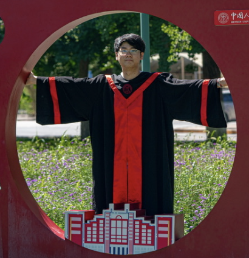
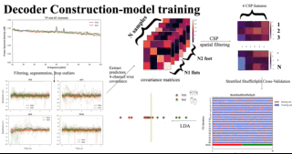
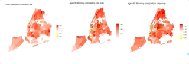

#### Second-year student in MS Biostatistics

#### Columbia University, Mailman School of Public Health

I’m a second-year M.S. student at [Columbia University](https://www.mailman.columbia.edu/become-student/departments/biostatistics). My advisors are Professor [Sen Pei](http://www.columbia.edu/~sp3449/) and professor [Xiaofu He](http://www.columbia.edu/~xh2170/), And I graduated form [Renmin university](https://www.ruc.edu.cn/en) statistic school in 2020.  
I love artificial intelligence and hope to combine AI methods with game development together to build a game that has NPCs that can learn and interact with players in unpredictable ways. And I want to start this journey by discovering how natural language expresses our thoughts.

### [CV](resources/kaiyu_cv.pdf) [GitHub](https://github.com/MeanStudent)

# Some of my project samples!
---  
    
   

 

---
### Contact Information

[Department of Biostatistics](http://www.mailman.columbia.edu/academic-departments/biostatistics)  
[Columbia Mailman School of Public Health](http://www.mailman.columbia.edu/)  
100 Haven Ave
 
New York, New York 10032  

